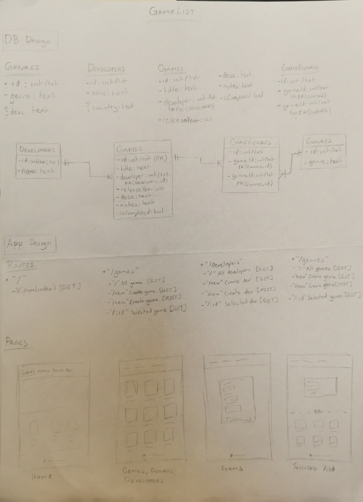

# Inventory App

This repository contains a simple web app that tracks a back log of games to play.

## Technologies Used

- Node
- Express
- PostgreSQL
- JavaScript
- EJS

## Installation

1. **Clone the repository**:

   ```bash
   git clone https://github.com/ishmyles/inventory-app.git
   cd inventory-app
   ```

2. **Install dependencies**:

   ```bash
   npm install
   ```

3. **Set up environment variables**:

   Create a `.env` file in the root directory and add the following variables:

   ```env
    DB_USERNAME= <Add your configured username>
    DB_PASSWORD= <Add your configured password>
    DB_DEV_HOST="localhost"
    DB_DEV_PORT="5432"
   ```

4. **Start the application**:

   ```bash
   node --watch --env-file .env app.js
   ```

   The app will be accessible at `http://localhost:3000`.

5. **Terminating the application**:

   Press Ctrl + C to terminate app.

## App Design


